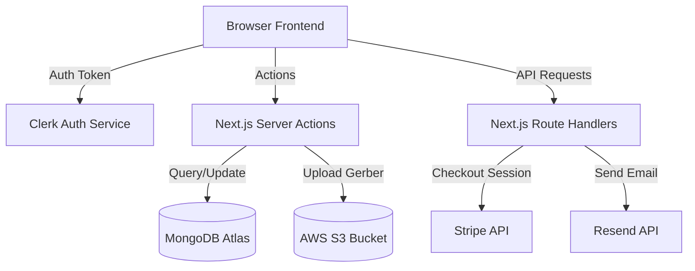

<!-- ⚠️  AUTO-GENERATED — Do NOT edit this file directly.
     Source: openspec/project.md + .ai/  directory
     Regenerate: npm run sync:context
     Platform: Antigravity
-->

# AI Context

# Circuit Parts (Electronic Store)

## About
An open-source, digital quote-to-order platform designed to streamline the sourcing of Embedded Electronic parts. Built with Next.js, Clerk, Stripe, MongoDB, Upstash Redis, and AWS S3.

---

## Architecture Rules
1. Next.js App Router for pages and API endpoints.
2. Type-safe configuration through Zod schema validation in `env.js`.
3. Server Actions for backend database operations and S3 file management.
4. Tailwind CSS and shadcn/ui for components and layout.

---

## AI Agent Change Flow

Before implementing any non-trivial change:
1. Read this file and relevant `.ai/` files.
2. Run: `openspec list` and `openspec list --specs`
3. Create proposal: `openspec/changes/{change-id}/proposal.md`
4. Get approval, then implement tasks.
5. Verify: `npm run build` + `openspec validate --strict`
6. Archive: `openspec archive {change-id} --yes`
7. Post-archive: check `doc/` for stale content + run `npm run sync:context`

**Slash commands (Antigravity workflows)**:
- `/proposal` — scaffold a new OpenSpec change
- `/apply` — implement an approved proposal
- `/archive` — archive a deployed change (includes doc/ check)

---

## AI Context File Index

| File | Purpose | When to Read |
|---|---|---|
| `.ai/ARCHITECTURE.md` | System architecture and data flow | Before touching core logic |
| `.ai/CONVENTIONS.md` | File naming, import aliases | Before creating new files |
| `.ai/GUARDRAILS.md` | Do/Don't rules, checklists | Before committing any change |
| `.ai/STACK.md` | Package versions and constraints | Before adding dependencies |
| `openspec/specs/` | Capability specs | Before proposing system changes |

---

## doc/ Update Policy
> **When archiving any OpenSpec change**, scan `doc/` for content that may be stale due to the archived change. Update them before the next dev session.

---

## Platform Context Sync
All platform-specific AI rule files (`.cursor/`, `.windsurfrules`, `.agents/`, `.github/copilot-instructions.md`) are **auto-generated**.

To regenerate:
```bash
npm run sync:context
```

---

# Architecture Reference

# Architecture Reference

## Overview
Circuit Parts is a digital quote-to-order electronic store built with Next.js 14. It uses a serverless, event-driven architecture combining React Server Components, Server Actions, and REST API endpoints.

## Folder Structure
- `/app` — App router pages, layouts, and API routes.
- `/components` — Shared React UI components (including email templates, header, footer).
- `/context` — React context providers for local state (Auth, Redux, Currency).
- `/data` — Mock/static data configurations.
- `/lib` — Utility functions, constants, server actions, and DB/S3 client instances.
- `/pages` — Documentation pages powered by Nextra.
- `/public` — Public static assets.
- `/tests` — E2E testing using Playwright.
- `/types` — Shared TypeScript type declarations.

## Data Flow


---

# Coding Conventions

# Coding Conventions

## Language Standards
- **TypeScript**: Always use TypeScript, define clear interfaces and type definitions under `/types`.
- **React Server Components (RSC)**: Keep components server-side by default. Use `"use client"` only when incorporating browser state, effects, or hooks.
- **Server Actions**: Place server-only logic in server action files (typically under `lib/server-actions/`) labeled with `"use server"`.

## Naming Conventions
- **Files**: Use kebab-case for filenames (`cart-actions.ts`, `stripe-checkout`), PascalCase for React component files (`Container.tsx`, `Header.tsx`).
- **Interfaces / Types**: Append type suffix to name, example: `UserType`, `CartItemType`.
- **Constants**: Use UPPER_SNAKE_CASE (`MONGODB_URL`, `DB_NAME`).

## Imports
- Use alias `@/` for imports referencing `/` directory:
  - Example: `import { env } from "@/env";`
  - Example: `import { Container } from "@/components/ui/container";`

---

# Guardrails & Rules

# AI Agent Guardrails

## ❌ Do NOT
1. Edit platform rule files directly (`.cursor/`, `.windsurfrules`, `.agents/rules/`, `.github/`). They are auto-generated. Edit the source files under `openspec/project.md` and `.ai/` and run `npm run sync:context`.

## ✅ Always
1. Use the OpenSpec workflow for architectural changes.
2. Verify changes with a local production build (`npm run build`) before making PRs.
3. Validate changes with `openspec validate --strict` to ensure no schema regressions.

## 🗃️ On Archiving an OpenSpec Change
After running `openspec archive <change-id> --yes`:
1. **Check `doc/`** for stale content.
2. **Re-sync platform files** — run `npm run sync:context`.

---

# Tech Stack

# Tech Stack

| Dependency | Target Version | Purpose |
|---|---|---|
| **Next.js** | `14.1.0` | React framework with App Router |
| **Clerk** | `^4.29.3` | User Authentication |
| **Tailwind CSS**| `^3.3.0` | Visual Styling |
| **MongoDB** | `^6.0.0` | Database Client |
| **Upstash Redis**| `^1.34.3` | Caching & Rate Limiting |
| **Stripe** | `^14.13.0`| Payment Gateway |
| **Resend** | `^2.0.0` | Transactional Emailing |
| **AWS SDK S3** | `^3.451.0` | Gerber File Storage |
| **Playwright** | `^1.41.2` | End-to-End Testing |
