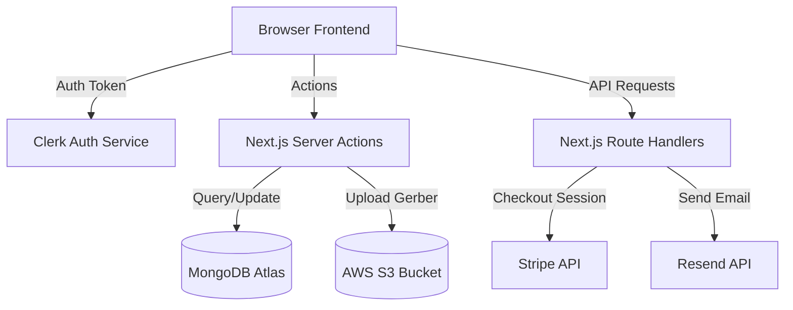

# Architecture Reference

## Overview
Circuit Parts is a digital quote-to-order electronic store built with Next.js 14. It uses a serverless, event-driven architecture combining React Server Components, Server Actions, and REST API endpoints.

## Folder Structure
- `/app` — App router pages, layouts, and API routes.
- `/components` — Shared React UI components (including email templates, header, footer).
- `/context` — React context providers for local state (Auth, Redux, Currency).
- `/data` — Mock/static data configurations.
- `/lib` — Utility functions, constants, server actions, and DB/S3 client instances.
- `/pages` — Documentation pages powered by Nextra.
- `/public` — Public static assets.
- `/tests` — E2E testing using Playwright.
- `/types` — Shared TypeScript type declarations.

## Data Flow

